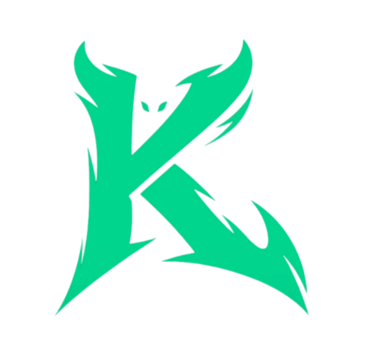

<div align="center">



# Krypt Trader (Universal / macOS port)

**A free, open-source Kalshi auto-trading desktop app, now running natively on macOS.**

Whale tracker, momentum scanner and a configurable trading engine in one clean app. Your keys and data never leave your machine.

[](LICENSE)
&nbsp;[](#download)
&nbsp;[](#download)
&nbsp;[](#download)
&nbsp;[](#download)

</div>

---

> [!NOTE]
> **This is my own macOS port of Krypt Trader.** The original app was Windows only, so I did the work to make it build and run natively on Mac. Every change I made is right here in the repo for you to read, diff against the original, and build yourself. If you do not trust a random binary (you shouldn't), just clone this and build it from source in a couple of minutes.
>
> Full credit for the original app goes to the [Krypt team](https://krypt.cc). This repo is just the Mac port plus the small cross-platform fixes needed to make it work.

Krypt Trader watches the public Kalshi markets for whale orders and momentum, scores them with built-in heuristics, and can size and place trades for you, wrapped in a modern desktop UI instead of a script you have to babysit. Your API keys and every trade stay in a local SQLite database on your machine. The only thing it talks to is Kalshi (and CoinGecko for crypto prices).

> [!WARNING]
> **This app places real orders on your Kalshi account, and trading carries real financial risk.** The bundled strategies are heuristics with **no proven, fee-adjusted edge** and may lose money. This is **not financial advice**. It ships on Kalshi's **demo** environment with **dry-run on**, so nothing trades for real until you flip both off. Please read the full [Disclaimer](DISCLAIMER.md).

## What I changed for the Mac port

Everything in the trading engine, the strategies, and the Kalshi API code is untouched. I only ported the parts that were Windows only, so the behavior is the same on both platforms:

- **Native macOS build.** Added the macOS packaging config and a proper `.icns` app icon, so `npm run dist` now produces a real `.dmg` and `.zip` on a Mac.
- **Credentials encrypted at rest on Mac.** Windows uses DPAPI to encrypt your keys. On Mac I wired up the login Keychain to do the same job, so your credentials are encrypted on disk and tied to your user account, exactly like on Windows.
- **Start at login** now works on Mac, not just Windows.
- **Correct Mac paths.** Data lives in the standard `~/Library/Application Support/Krypt Trader/` location, and the menu bar tray icon is sized properly for macOS.
- **A small build fix** so it installs cleanly on modern Python (the original pinned an old build tool that will not install on Python 3.13+).

## What it does

- **Whale tracker.** Watches the live Kalshi trade feed for big taker orders and surfaces the highest-edge ones in real time.
- **Momentum scanner.** Flags volume spikes, price moves and trade clusters, with a contrarian mode that fades the crowd.
- **15-minute crypto.** Monitors Kalshi's 15-min BTC, ETH, SOL and other crypto markets with a configurable momentum strategy and an optional paper/live executor.
- **Auto-trader.** Sizes positions by edge, places limit-cross orders, tracks fills and resolutions, and reconciles its book against Kalshi on every restart.
- **Profiles & Discord.** Save, import and export tuned configs, with optional Discord webhooks and Rich Presence.
- **Local-first.** Keys and trade history live under `~/Library/Application Support/Krypt Trader/` on macOS (and `%APPDATA%/Krypt Trader/` on Windows). No account, no telemetry, no middleman server.

## Safe by default

- Starts in **demo + dry-run**, so you have to turn both off before a single real order goes out. (The 15-minute crypto tab has its own separate live switch.)
- A **daily stop-loss / take-profit, trading-hours windows and a master kill-switch** gate the engine.
- **Credentials are encrypted at rest** using the macOS login Keychain (or Windows DPAPI), tied to your user account, never sent anywhere.
- A **fee-aware backtest** (`npm run py:backtest`) measures the net-of-fee edge on *your own* resolved signals, so run it before trusting any preset.

## Download

Grab the latest `.dmg` from the [Releases](../../releases/latest) page, open it, and drag Krypt Trader to Applications. Then open **API Keys** and connect your Kalshi key + RSA private key. It starts in demo + dry-run, so nothing trades until you turn both off.

> The build is not code-signed (it is a free open-source port, not a paid App Store app), so the first time you open it macOS will warn you. Just right-click the app and choose **Open**, then **Open** again. You only have to do this once. If you would rather not run my binary at all, build it yourself from source below.

## Build from source

This is the recommended way if you care about trust. You can read every line, then build it yourself.

```bash
git clone https://github.com/legaldusty/krypt-trader-universal.git
cd krypt-trader-universal
npm install
npm run dev      # auto-creates python/.venv on first run (~30s)
npm run dist     # build the app for whatever OS you are on, output lands in /release
```

Requires [Node.js](https://nodejs.org) 18+ and [Python](https://python.org) 3.10+ on PATH.

`npm run dist` builds for **whichever OS you run it on**. On a Mac you get a `.dmg` and a `.zip`. On Windows you get the `.exe` installer. Each one bundles a native Python backend. PyInstaller only targets the architecture you build on, so build the Mac app on the chip (Apple Silicon or Intel) you actually want to ship.

## Need a Kalshi account?

Sign up through the original team's referral and Kalshi gives you **$25 free** after your first deposit:
<https://kalshi.com/sign-up?referral=e258d0db-6ca0-4efc-8435-3592397ada4c>

## Credit

The original Krypt Trader was built by the Krypt team. This repo is my macOS / universal port of it.

- **Original project** by [krypt.cc](https://krypt.cc), more free tools at [krypt.cc/tools](https://krypt.cc/tools)
- **This port and its source** are right here for you to inspect and build

## License

Released under the [MIT License](LICENSE), free to use, fork and share. Please don't rebrand and resell it. Provided **as-is, with no warranty**, see the [Disclaimer](DISCLAIMER.md).

<div align="center"><sub>Original by the Krypt team. macOS port maintained in this repo.</sub></div>
